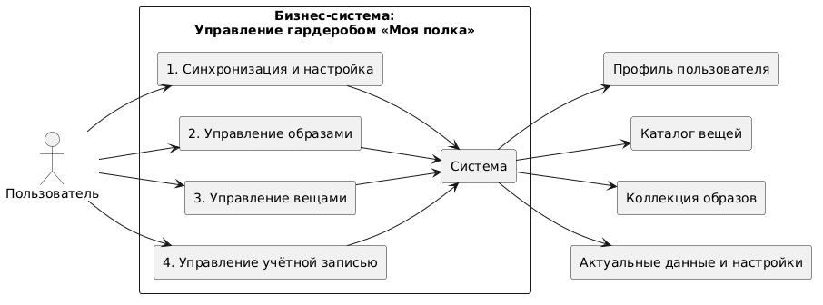

# BUC-диаграмма


# Пояснение
На диаграмме представлена бизнес-система управления гардеробом «Моя полка». Пользователь взаимодействует с системой через четыре основных процесса: синхронизацию и настройку, управление образами, управление вещами и управление учётной записью. Все эти процессы связаны с центральным компонентом «Система», который в свою очередь взаимодействует с четырьмя элементами: профилем пользователя, каталогом вещей, коллекцией образов и актуальными данными и настройками.

# Код PlantUML
```
@startuml
skinparam packageStyle rectangle
skinparam componentStyle rectangle
left to right direction
package "Бизнес-система:\nУправление гардеробом «Моя полка»" {
    
    rectangle "1. Синхронизация и настройка" as sync
    rectangle "2. Управление образами" as img
    rectangle "3. Управление вещами" as items
    rectangle "4. Управление учётной записью" as account
    
    rectangle "Система" as system
    
    sync --> system
    img --> system
    items --> system
    account --> system
    
}

actor "Пользователь" as user

user --> sync
user --> img
user --> items
user --> account

rectangle "Профиль пользователя" as profile
rectangle "Каталог вещей" as catalog
rectangle "Коллекция образов" as collection
rectangle "Актуальные данные и настройки" as data

system --> profile
system --> catalog
system --> collection
system --> data

@enduml
```