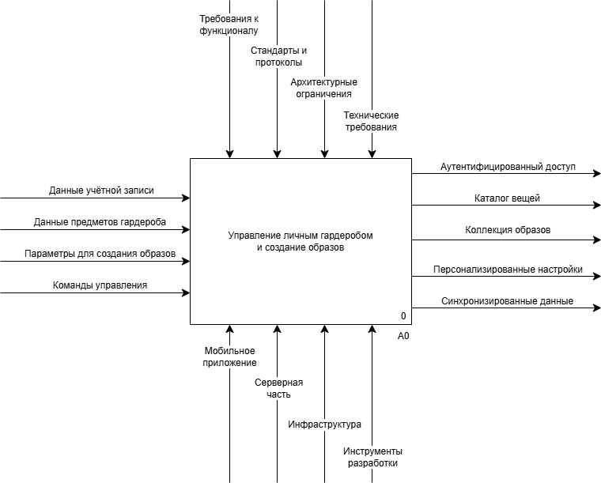

# Диаграмма бизнес-контекста (IDEF0 A-0)

# Пояснение
Диаграмма бизнес-контекста IDEF0 уровня A-0 представляет приложение *«Моя полка»* в виде единого функционального блока, основной задачей которого является обеспечение управления личным гардеробом и создание готовых образов.
*Процесс работы системы* начинается с входных данных, поступающих слева и включающих информацию об учётных записях, фотографии и атрибуты предметов одежды, параметры для сборки комплектов, а также пользовательские команды на поиск, редактирование и запуск синхронизации.
*Деятельность приложения* строго регламентируется управляющими воздействиями сверху, которые задаются спецификацией MVP, бизнес-правилами, пользовательскими сценариями, архитектурными ограничениями клиент-серверной модели, а также стандартами разработки, требованиями к тестовому покрытию, минимальной версии Android и протоколами безопасности.
*Техническая реализация* функции обеспечивается механизмами снизу, объединяющими мобильный клиент на базе Kotlin и Jetpack Compose с локальной базой данных Room, серверную часть на Java и Spring Boot с PostgreSQL, а также инфраструктуру аутентификации, механизмы синхронизации и инструменты разработки.
В результате обработки входных потоков под заданными ограничениями и с использованием указанных технологий система формирует выходы справа: подтверждённый доступ по JWT-токенам, структурированный каталог вещей с результатами фильтрации, готовые коллекции образов, персонализированные настройки интерфейса и успешно синхронизированные данные, согласованные между локальным устройством и облачным сервером.