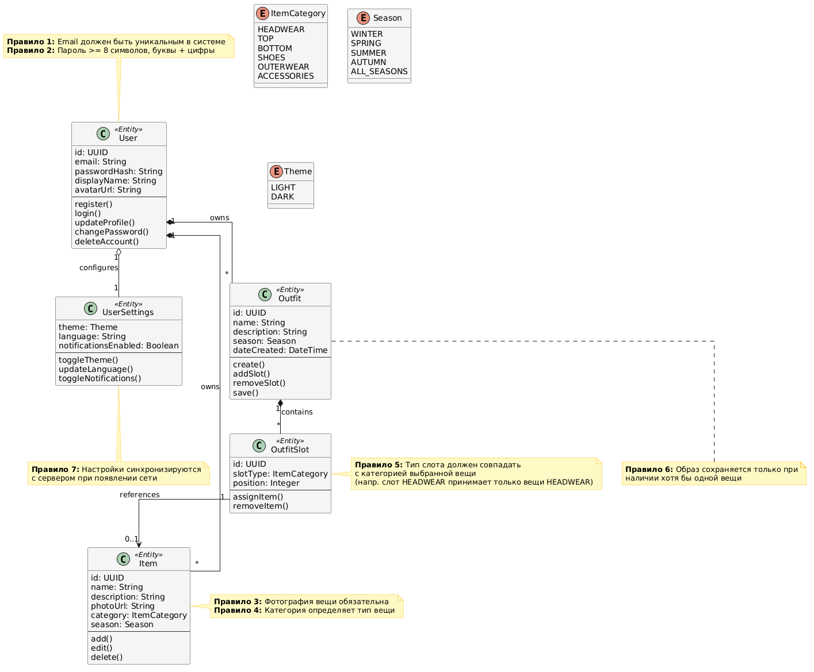

# Domain Model


# Пояснение
Модель отражает ключевые сущности, их атрибуты, поведение и бизнес-правила, выведенные из пользовательского сценария.

## Описание модели

### 1. Сущности (Entities)
*   **User**: Корень агрегата (Aggregate Root). Управляет аутентификацией, профилем и владеет всеми данными гардероба.
*   **Item**: Предмет одежды. Содержит метаданные (фото, категория, сезон). Является частью агрегата пользователя.
*   **Outfit**: Готовый комплект одежды. Содержит структуру образа.
*   **OutfitSlot**: Структурный элемент образа. Позволяет реализовать требование "конструктора со слотами" (например, слот "Обувь" может содержать только вещь категории "Обувь").
*   **UserSettings**: Настройки приложения (тема, язык), привязанные к конкретному пользователю.

### 2. Связи
*   **Композиция (User -> Item/Outfit)**: Вещи и образы не существуют без пользователя. При удалении аккаунта удаляются и данные гардероба.
*   **Композиция (Outfit -> OutfitSlot)**: Образ состоит из слотов. Слоты не имеют смысла вне контекста конкретного образа.
*   **Ассоциация (OutfitSlot -> Item)**: Слот *ссылается* на вещь. Одна и та же вещь может использоваться в разных слотах разных образов, поэтому это не композиция.

### 3. Бизнес-правила (Sticky Notes)
*   **Валидация данных**: Уникальность email, сложность пароля, обязательность фото.
*   **Логика конструктора**: Строгое соответствие категории вещи типу слота (защита от ошибок пользователя).
*   **Синхронизация**: Гарантии сохранения данных при офлайн-работе (критично для MVP).

# Код PlantUML
```
@startuml
skinparam linetype ortho
skinparam packageStyle rectangle
skinparam backgroundColor #FFFFFF
skinparam classBackgroundColor #F5F5F5
skinparam classBorderColor #333333
skinparam enumBackgroundColor #E8E8E8
skinparam noteBackgroundColor #FFF9C4
skinparam noteBorderColor #FBC02D

' === ENUMS (Статусы и Типы) ===
enum ItemCategory {
  HEADWEAR
  TOP
  BOTTOM
  SHOES
  OUTERWEAR
  ACCESSORIES
}

enum Season {
  WINTER
  SPRING
  SUMMER
  AUTUMN
  ALL_SEASONS
}

enum Theme {
  LIGHT
  DARK
}

' === ENTITIES (Сущности) ===

class User <<Entity>> {
  id: UUID
  email: String
  passwordHash: String
  displayName: String
  avatarUrl: String
  --
  register()
  login()
  updateProfile()
  changePassword()
  deleteAccount()
}

class UserSettings <<Entity>> {
  theme: Theme
  language: String
  notificationsEnabled: Boolean
  --
  toggleTheme()
  updateLanguage()
  toggleNotifications()
}

class Item <<Entity>> {
  id: UUID
  name: String
  description: String
  photoUrl: String
  category: ItemCategory
  season: Season
  --
  add()
  edit()
  delete()
}

class Outfit <<Entity>> {
  id: UUID
  name: String
  description: String
  season: Season
  dateCreated: DateTime
  --
  create()
  addSlot()
  removeSlot()
  save()
}

class OutfitSlot <<Entity>> {
  id: UUID
  slotType: ItemCategory
  position: Integer
  --
  assignItem()
  removeItem()
}

' === RELATIONSHIPS (Связи) ===

' Пользователь владеет настройками (1 к 1)
User "1" o-- "1" UserSettings : configures

' Пользователь владеет вещами (1 ко многим)
User "1" *-- "*" Item : owns

' Пользователь владеет образами (1 ко многим)
User "1" *-- "*" Outfit : owns

' Образ состоит из слотов (Композиция)
Outfit "1" *-- "*" OutfitSlot : contains

' Слот ссылается на вещь (Ассоциация)
OutfitSlot "1" --> "0..1" Item : references

' === BUSINESS RULES (Бизнес-правила) ===

note top of User
  **Правило 1:** Email должен быть уникальным в системе
  **Правило 2:** Пароль >= 8 символов, буквы + цифры
end note

note right of Item
  **Правило 3:** Фотография вещи обязательна
  **Правило 4:** Категория определяет тип вещи
end note

note right of OutfitSlot
  **Правило 5:** Тип слота должен совпадать
  с категорией выбранной вещи
  (напр. слот HEADWEAR принимает только вещи HEADWEAR)
end note

note bottom of Outfit
  **Правило 6:** Образ сохраняется только при
  наличии хотя бы одной вещи
end note

note bottom of UserSettings
  **Правило 7:** Настройки синхронизируются
  с сервером при появлении сети
end note

@enduml
```