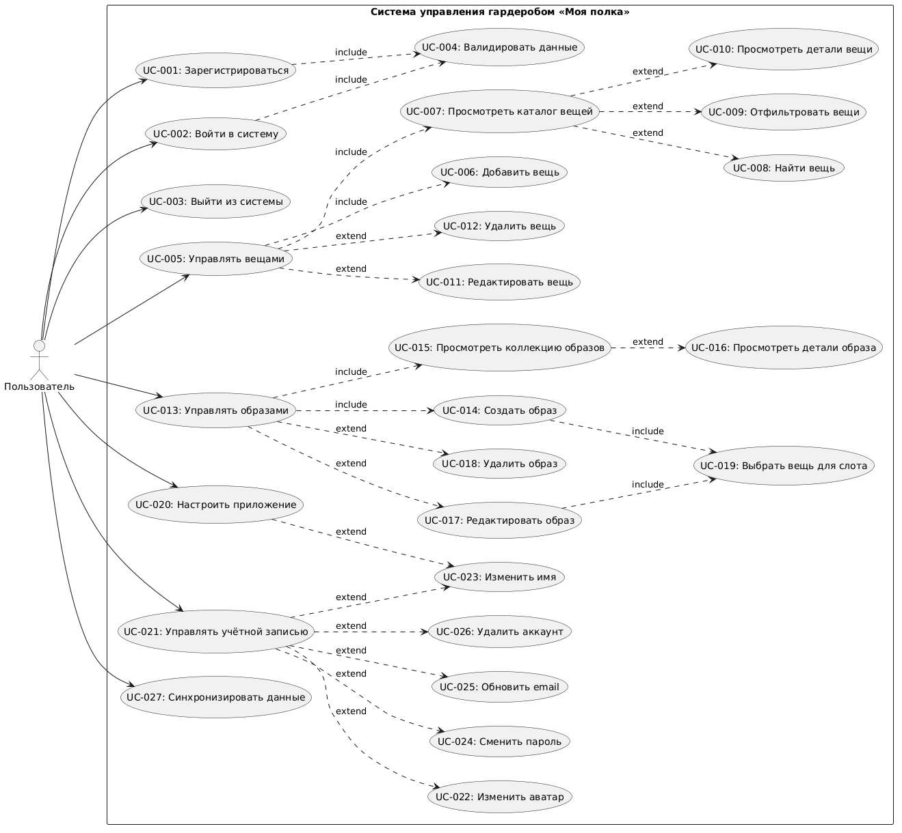

# Диаграмма прецедентов


# Пояснение
## Связи «include» (включение)

**`include`** обозначает обязательное включение одного варианта использования в другой. Базовый use case не может выполниться без включаемого.

1. **UC_Register → UC_Validate** и **UC_Login → UC_Validate**  
   При регистрации и входе обязательно выполняется валидация данных (проверка корректности email, сложности пароля, соответствия форматов).

2. **UC_ManageItems → UC_AddItem** и **UC_ManageItems → UC_ViewItems**  
   Управление вещами обязательно включает возможность добавления новых вещей и просмотра существующего каталога — это базовые операции.

3. **UC_ManageOutfits → UC_CreateOutfit** и **UC_ManageOutfits → UC_ViewOutfits**  
   Аналогично, управление образами обязательно включает создание новых образов и просмотр коллекции.

4. **UC_CreateOutfit → UC_SelectItemForSlot** и **UC_EditOutfit → UC_SelectItemForSlot**  
   При создании или редактировании образа обязательно происходит выбор вещей для слотов (головной убор, верхняя одежда, обувь и т.д.).

## Связи «extend» (расширение)

**`extend`** обозначает опциональное расширение базового варианта использования. Расширение выполняется только при определённых условиях.

1. **UC_ViewItems ← UC_SearchItem**, **UC_FilterItems**, **UC_ViewItemDetails**  
   Просмотр каталога вещей может быть расширен поиском по названию, фильтрацией по категориям/сезонам или просмотром детальной информации о конкретной вещи. Эти действия выполняются по желанию пользователя.

2. **UC_ManageItems ← UC_EditItem**, **UC_DeleteItem**  
   Редактирование и удаление вещей — опциональные операции, которые выполняются только когда пользователь хочет изменить или удалить существующую вещь.

3. **UC_ViewOutfits ← UC_ViewOutfitDetails**  
   Просмотр коллекции образов может быть расширен просмотром деталей конкретного образа.

4. **UC_ManageOutfits ← UC_EditOutfit**, **UC_DeleteOutfit**  
   Редактирование и удаление образов выполняются по необходимости, а не при каждом использовании системы.

5. **UC_ManageAccount ← UC_ChangeAvatar**, **UC_ChangeName**, **UC_ChangePassword**, **UC_ChangeEmail**, **UC_DeleteAccount**  
   Управление учётной записью может включать различные опциональные операции: изменение аватара, имени, пароля, email или удаление аккаунта. Пользователь выполняет только те действия, которые ему нужны.

6. **UC_ConfigureApp ← UC_ChangeName**  
   Настройка приложения может включать изменение отображаемого имени (дублируется из управления аккаунтом для удобства доступа).

# Код PlantUML
```
@startuml
left to right direction
skinparam packageStyle rectangle

actor "Пользователь" as User

rectangle "Система управления гардеробом «Моя полка»" {
  
  ' Аутентификация и регистрация
  usecase "UC-001: Зарегистрироваться" as UC_001
  usecase "UC-002: Войти в систему" as UC_002
  usecase "UC-003: Выйти из системы" as UC_003
  usecase "UC-004: Валидировать данные" as UC_004
  
  ' Управление вещами
  usecase "UC-005: Управлять вещами" as UC_005
  usecase "UC-006: Добавить вещь" as UC_006
  usecase "UC-007: Просмотреть каталог вещей" as UC_007
  usecase "UC-008: Найти вещь" as UC_008
  usecase "UC-009: Отфильтровать вещи" as UC_009
  usecase "UC-010: Просмотреть детали вещи" as UC_010
  usecase "UC-011: Редактировать вещь" as UC_011
  usecase "UC-012: Удалить вещь" as UC_012
  
  ' Управление образами
  usecase "UC-013: Управлять образами" as UC_013
  usecase "UC-014: Создать образ" as UC_014
  usecase "UC-015: Просмотреть коллекцию образов" as UC_015
  usecase "UC-016: Просмотреть детали образа" as UC_016
  usecase "UC-017: Редактировать образ" as UC_017
  usecase "UC-018: Удалить образ" as UC_018
  usecase "UC-019: Выбрать вещь для слота" as UC_019
  
  ' Настройки и профиль
  usecase "UC-020: Настроить приложение" as UC_020
  usecase "UC-021: Управлять учётной записью" as UC_021
  usecase "UC-022: Изменить аватар" as UC_022
  usecase "UC-023: Изменить имя" as UC_023
  usecase "UC-024: Сменить пароль" as UC_024
  usecase "UC-025: Обновить email" as UC_025
  usecase "UC-026: Удалить аккаунт" as UC_026
  
  ' Синхронизация
  usecase "UC-027: Синхронизировать данные" as UC_027
}

' Связи актера с основными use case
User --> UC_001
User --> UC_002
User --> UC_003
User --> UC_005
User --> UC_013
User --> UC_020
User --> UC_021
User --> UC_027

' Валидация данных
UC_001 ..> UC_004 : include
UC_002 ..> UC_004 : include

' Управление вещами
UC_005 ..> UC_006 : include
UC_005 ..> UC_007 : include
UC_007 ..> UC_008 : extend
UC_007 ..> UC_009 : extend
UC_007 ..> UC_010 : extend
UC_005 ..> UC_011 : extend
UC_005 ..> UC_012 : extend

' Управление образами
UC_013 ..> UC_014 : include
UC_013 ..> UC_015 : include
UC_015 ..> UC_016 : extend
UC_013 ..> UC_017 : extend
UC_013 ..> UC_018 : extend
UC_014 ..> UC_019 : include
UC_017 ..> UC_019 : include

' Управление учётной записью
UC_021 ..> UC_022 : extend
UC_021 ..> UC_023 : extend
UC_021 ..> UC_024 : extend
UC_021 ..> UC_025 : extend
UC_021 ..> UC_026 : extend

' Настройка приложения
UC_020 ..> UC_023 : extend

@enduml
```