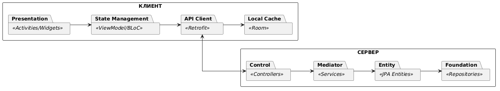
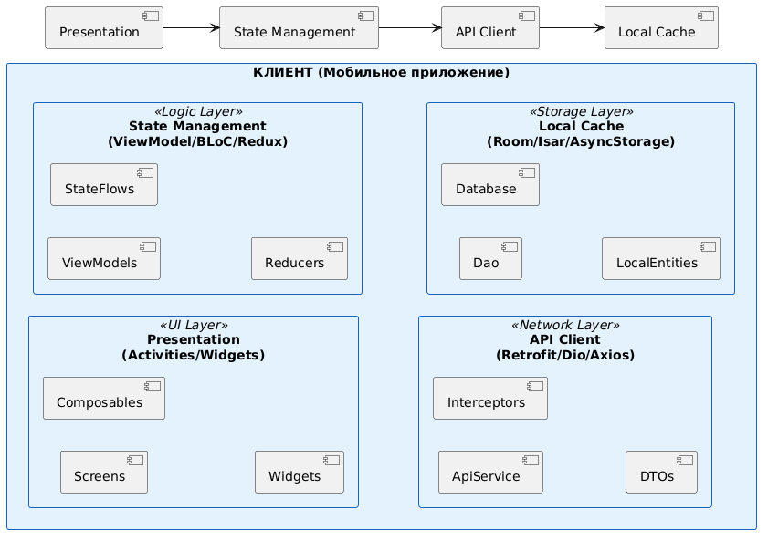
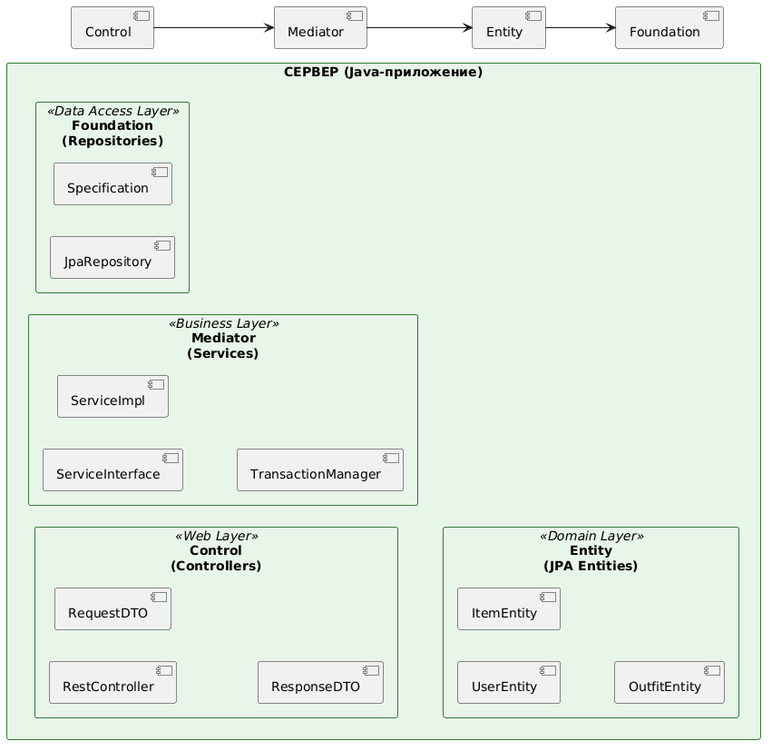

# Диаграммы пакетов
## Общая диаграмма PCMEF


## Диаграмма пакетов клиента


## Диаграмма пакетов сервера


# Пояснение
Общая диаграмма диаграмма демонстрирует, как слои клиента и сервера взаимодействуют друг с другом через границу REST API.
Диаграмма пакетов клиента показывает структуру мобильного приложения. Слой Foundation разделен на внешний API (Retrofit) и локальное хранилище (Room). Слой Control реализован через ViewModel/State Management.
На сервере слой Presentation отсутствует в явном виде (его роль выполняет HTTP-протокол и сериализация JSON), поэтому архитектура начинается со слоя Control (REST Controllers).


# Код PlantUML
## Общая диаграмма PCMEF
```
@startuml General_PCMEF
skinparam linetype ortho
skinparam packageStyle rectangle
skinparam backgroundColor #FFFFFF
left to right direction

rectangle "КЛИЕНТ" as Client {
    package "Presentation" <<Activities/Widgets>>
    package "State Management" <<ViewModel/BLoC>>
    package "API Client" <<Retrofit>>
    package "Local Cache" <<Room>>
    
    ' Внутренние связи клиента
    [Presentation] --> [State Management]
    [State Management] --> [API Client]
    [API Client] --> [Local Cache]
}

rectangle "СЕРВЕР" as Server {
    package "Control" <<Controllers>>
    package "Mediator" <<Services>>
    package "Entity" <<JPA Entities>>
    package "Foundation" <<Repositories>>
    
    ' Внутренние связи сервера
    [Control] --> [Mediator]
    [Mediator] --> [Entity]
    [Entity] --> [Foundation]
}

' Связь между клиентом и сервером
' На схеме стрелка идет от Presentation к REST API -> Control
' Технически запрос инициирует API Client, но логически это запрос от UI
[API Client] <--> [Control]

@enduml
```

## Диаграмма пакетов клиента
```
@startuml Client_PCMEF_Corrected
skinparam linetype ortho
skinparam packageStyle rectangle
skinparam backgroundColor #FFFFFF
skinparam packageBackgroundColor #E3F2FD
skinparam packageBorderColor #1565C0
left to right direction

rectangle "КЛИЕНТ (Мобильное приложение)" {
    
    package "Presentation\n(Activities/Widgets)" <<UI Layer>> {
        [Screens]
        [Composables]
        [Widgets]
    }

    package "State Management\n(ViewModel/BLoC/Redux)" <<Logic Layer>> {
        [ViewModels]
        [StateFlows]
        [Reducers]
    }

    package "API Client\n(Retrofit/Dio/Axios)" <<Network Layer>> {
        [ApiService]
        [Interceptors]
        [DTOs]
    }
    
    package "Local Cache\n(Room/Isar/AsyncStorage)" <<Storage Layer>> {
        [Dao]
        [Database]
        [LocalEntities]
    }
}

[Presentation] --> [State Management]
[State Management] --> [API Client]
[API Client] --> [Local Cache]

@enduml
```

## Диаграмма пакетов сервера
```
@startuml Server_PCMEF
skinparam linetype ortho
skinparam packageStyle rectangle
skinparam backgroundColor #FFFFFF
skinparam packageBackgroundColor #E8F5E9
skinparam packageBorderColor #2E7D32
left to right direction

rectangle "СЕРВЕР (Java-приложение)" {
    
    package "Control\n(Controllers)" <<Web Layer>> {
        [RestController]
        [RequestDTO]
        [ResponseDTO]
    }

    package "Mediator\n(Services)" <<Business Layer>> {
        [ServiceInterface]
        [ServiceImpl]
        [TransactionManager]
    }

    package "Entity\n(JPA Entities)" <<Domain Layer>> {
        [UserEntity]
        [ItemEntity]
        [OutfitEntity]
    }
    
    package "Foundation\n(Repositories)" <<Data Access Layer>> {
        [JpaRepository]
        [Specification]
    }
}

[Control] --> [Mediator]
[Mediator] --> [Entity]
[Entity] --> [Foundation]

@enduml
```