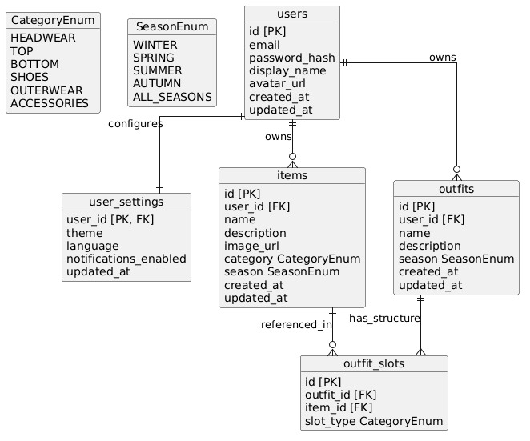

# ER-диаграмма базы данных


# Пояснение
Представленная диаграмма описывает логическую структуру базы данных приложения «Моя полка». Модель построена с учетом требований к клиент-серверной архитектуре и паттерну PCMEF, обеспечивая хранение пользовательских данных, каталога вещей и структурированных образов.

## 1. Блок «Пользователь и Настройки (Users & User Settings)»
*   **`users`**: Центральная сущность системы. Хранит данные для аутентификации (`email`, `password_hash`) и профильную информацию (`display_name`, `avatar_url`). Является корнем агрегата, владеющим всеми остальными данными.
*   **`user_settings`**: Сущность, связанная с пользователем отношением «один к одному» (`user_id` как первичный и внешний ключ). Хранит параметры персонализации интерфейса (тема, язык, уведомления), отделяя их от базовых данных профиля.

## 2. Блок «Гардероб» (Items)
*   **`items`**: Представляет цифровую карточку предмета одежды.
    *   Связана с `users` отношением «один ко многим» (один пользователь может иметь много вещей).
    *   Содержит метаданные: название, описание, ссылку на изображение.
    *   Использует перечисления `CategoryEnum` и `SeasonEnum` для строгой типизации данных (например, категория «Обувь» или сезон «Зима»), что упрощает фильтрацию и валидацию на уровне приложения.

## 3. Блок «Образы и Структура» (Outfits & Slots)
Этот блок реализует ключевую особенность приложения — визуальный конструктор образов со слотами.
*   **`outfits`**: Представляет готовый комплект одежды. Привязан к пользователю (`user_id`).
*   **`outfit_slots`**: Ассоциативная сущность (промежуточная таблица), которая реализует связь «многие ко многим» между образами (`outfits`) и вещами (`items`), но с важной особенностью — **структурированием**.
    *   Поле `slot_type` (типа `CategoryEnum`) фиксирует роль вещи в конкретном образе (например, этот слот предназначен для «Головного убора»).
    *   Это гарантирует, что в образе соблюдается логика сборки: в слот «Обувь» можно добавить только вещь категории «Обувь».
    *   Одна и та же вещь (`item_id`) может участвовать в разных образах в разных ролях, но в рамках одного образа она занимает конкретную позицию.

## 4. Справочные данные (Enums)
*   **`CategoryEnum`** и **`SeasonEnum`**: Определяют допустимые значения для категорий одежды и сезонов. Использование перечислений на уровне модели данных предотвращает появление некорректных записей (например, опечаток в названиях категорий) и согласует логику клиента и сервера.

# Код PlantUML
```
@startuml
skinparam linetype ortho
skinparam packageStyle rectangle
skinparam backgroundColor #FFFFFF

' === ENUMS ===
' Перечисления категорий и сезонов для строгой типизации данных
object CategoryEnum {
  HEADWEAR
  TOP
  BOTTOM
  SHOES
  OUTERWEAR
  ACCESSORIES
}

object SeasonEnum {
  WINTER
  SPRING
  SUMMER
  AUTUMN
  ALL_SEASONS
}

' === ТАБЛИЦЫ БД ===

object users {
  id [PK]
  email
  password_hash 
  display_name
  avatar_url
  created_at
}

object user_settings {
  user_id [PK, FK]
  theme
  language
  notifications_enabled
  updated_at
}

object items {
  id [PK]
  user_id [FK]
  name
  description
  image_url
  category CategoryEnum
  season SeasonEnum
  created_at
  updated_at
}

object outfits {
  id [PK]
  user_id [FK]
  name
  description
  season SeasonEnum
  created_at
  updated_at
}

' Промежуточная таблица для реализации связи "Многие ко многим" + слоты
object outfit_slots {
  id [PK]
  outfit_id [FK]
  item_id [FK]
  slot_type CategoryEnum
}

' === СВЯЗИ (RELATIONSHIPS) ===

' Настройки пользователя (1 к 1)
users ||--|| user_settings : configures

' Владелец вещей (1 ко многим)
users ||--o{ items : owns

' Владелец образов (1 ко многим)
users ||--o{ outfits : owns

' Образ состоит из слотов (1 ко многим)
outfits ||--|{ outfit_slots : has_structure

' Слот ссылается на вещь (1 ко многим: одна вещь может быть в разных образах)
items ||--o{ outfit_slots : referenced_in

@enduml
```