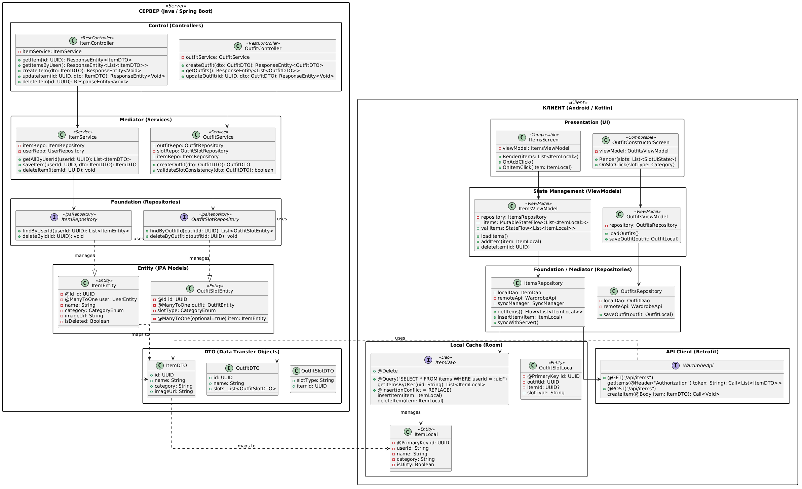

# Диаграмма классов проектирования


# Пояснение


# Код PlantUML
```
@startuml
skinparam linetype ortho
skinparam packageStyle rectangle

' ==========================================
' ПАКЕТ СЕРВЕРА (Java / Spring Boot)
' ==========================================
package "СЕРВЕР (Java / Spring Boot)" <<Server>> {
    
    package "Control (Controllers)" {
        class ItemController <<RestController>> {
            - itemService: ItemService
            + getItem(id: UUID): ResponseEntity<ItemDTO>
            + getItemsByUser(): ResponseEntity<List<ItemDTO>>
            + createItem(dto: ItemDTO): ResponseEntity<Void>
            + updateItem(id: UUID, dto: ItemDTO): ResponseEntity<Void>
            + deleteItem(id: UUID): ResponseEntity<Void>
        }
        
        class OutfitController <<RestController>> {
            - outfitService: OutfitService
            + createOutfit(dto: OutfitDTO): ResponseEntity<OutfitDTO>
            + getOutfits(): ResponseEntity<List<OutfitDTO>>
            + updateOutfit(id: UUID, dto: OutfitDTO): ResponseEntity<Void>
        }
    }

    package "Mediator (Services)" {
        class ItemService <<Service>> {
            - itemRepo: ItemRepository
            - userRepo: UserRepository
            + getAllByUserId(userId: UUID): List<ItemDTO>
            + saveItem(userId: UUID, dto: ItemDTO): ItemDTO
            + deleteItem(itemId: UUID): void
        }
        
        class OutfitService <<Service>> {
            - outfitRepo: OutfitRepository
            - slotRepo: OutfitSlotRepository
            - itemRepo: ItemRepository
            + createOutfit(dto: OutfitDTO): OutfitDTO
            + validateSlotConsistency(dto: OutfitDTO): boolean
        }
    }

    package "Foundation (Repositories)" {
        interface ItemRepository <<JpaRepository>> {
            + findByUserId(userId: UUID): List<ItemEntity>
            + deleteById(id: UUID): void
        }
        
        interface OutfitSlotRepository <<JpaRepository>> {
            + findByOutfitId(outfitId: UUID): List<OutfitSlotEntity>
            + deleteByOutfitId(outfitId: UUID): void
        }
    }

    package "Entity (JPA Models)" {
        class ItemEntity <<Entity>> {
            - @Id id: UUID
            - @ManyToOne user: UserEntity
            - name: String
            - category: CategoryEnum
            - imageUrl: String
            - isDeleted: Boolean
        }
        
        class OutfitSlotEntity <<Entity>> {
            - @Id id: UUID
            - @ManyToOne outfit: OutfitEntity
            - @ManyToOne(optional=true) item: ItemEntity
            - slotType: CategoryEnum
        }
    }

    package "DTO (Data Transfer Objects)" {
        class ItemDTO {
            + id: UUID
            + name: String
            + category: String
            + imageUrl: String
        }
        
        class OutfitDTO {
            + id: UUID
            + name: String
            + slots: List<OutfitSlotDTO>
        }
        
        class OutfitSlotDTO {
            + slotType: String
            + itemId: UUID
        }
    }
}

' ==========================================
' ПАКЕТ КЛИЕНТА (Android / Kotlin)
' ==========================================
package "КЛИЕНТ (Android / Kotlin)" <<Client>> {

    package "Presentation (UI)" {
        class ItemsScreen <<Composable>> {
            - viewModel: ItemsViewModel
            + Render(items: List<ItemLocal>)
            + OnAddClick()
            + OnItemClick(item: ItemLocal)
        }
        
        class OutfitConstructorScreen <<Composable>> {
            - viewModel: OutfitsViewModel
            + Render(slots: List<SlotUIState>)
            + OnSlotClick(slotType: Category)
        }
    }

    package "State Management (ViewModels)" {
        class ItemsViewModel <<ViewModel>> {
            - repository: ItemsRepository
            - _items: MutableStateFlow<List<ItemLocal>>
            + val items: StateFlow<List<ItemLocal>>
            + loadItems()
            + addItem(item: ItemLocal)
            + deleteItem(id: UUID)
        }
        
        class OutfitsViewModel <<ViewModel>> {
            - repository: OutfitsRepository
            + loadOutfits()
            + saveOutfit(outfit: OutfitLocal)
        }
    }

    package "Foundation / Mediator (Repositories)" {
        class ItemsRepository {
            - localDao: ItemDao
            - remoteApi: WardrobeApi
            - syncManager: SyncManager
            + getItems(): Flow<List<ItemLocal>>
            + insertItem(item: ItemLocal)
            + syncWithServer()
        }
        
        class OutfitsRepository {
            - localDao: OutfitDao
            - remoteApi: WardrobeApi
            + saveOutfit(outfit: OutfitLocal)
        }
    }

    package "Local Cache (Room)" {
        interface ItemDao <<Dao>> {
            + @Query("SELECT * FROM items WHERE userId = :uid")
              getItemsByUser(uid: String): List<ItemLocal>
            + @Insert(onConflict = REPLACE)
              insertItem(item: ItemLocal)
            + @Delete
              deleteItem(item: ItemLocal)
        }
        
        class ItemLocal <<Entity>> {
            - @PrimaryKey id: UUID
            - userId: String
            - name: String
            - category: String
            - isDirty: Boolean
        }
        
        class OutfitSlotLocal <<Entity>> {
            - @PrimaryKey id: UUID
            - outfitId: UUID
            - itemId: UUID?
            - slotType: String
        }
    }

    package "API Client (Retrofit)" {
        interface WardrobeApi {
            + @GET("/api/items")
              getItems(@Header("Authorization") token: String): Call<List<ItemDTO>>
            + @POST("/api/items")
              createItem(@Body item: ItemDTO): Call<Void>
        }
    }
}

' ==========================================
' СВЯЗИ (RELATIONSHIPS)
' ==========================================

' Server Connections
ItemController --> ItemService
OutfitController --> OutfitService
ItemService --> ItemRepository
OutfitService --> OutfitSlotRepository
ItemRepository ..|> ItemEntity : manages
OutfitSlotRepository ..|> OutfitSlotEntity : manages
ItemController ..> ItemDTO : uses
OutfitController ..> OutfitDTO : uses

' Client Connections
ItemsScreen --> ItemsViewModel
OutfitConstructorScreen --> OutfitsViewModel
ItemsViewModel --> ItemsRepository
OutfitsViewModel --> OutfitsRepository
ItemsRepository --> ItemDao
ItemsRepository --> WardrobeApi
ItemDao ..> ItemLocal : manages
WardrobeApi ..> ItemDTO : uses

' Cross-Layer Mapping (Implicit)
ItemDTO ..> ItemLocal : maps to
ItemEntity ..> ItemDTO : maps to

@enduml
```