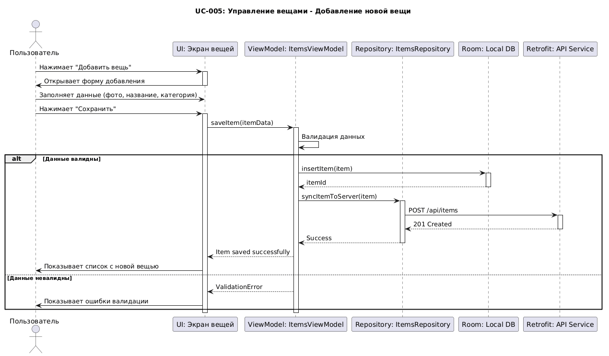
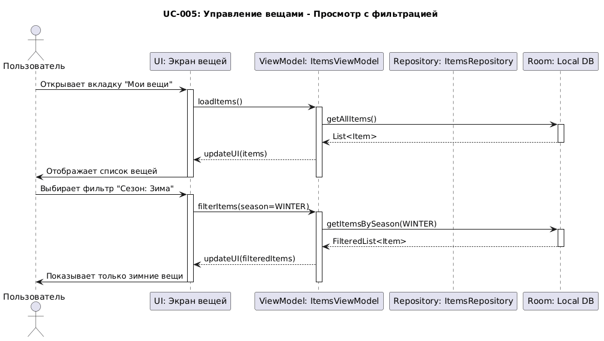
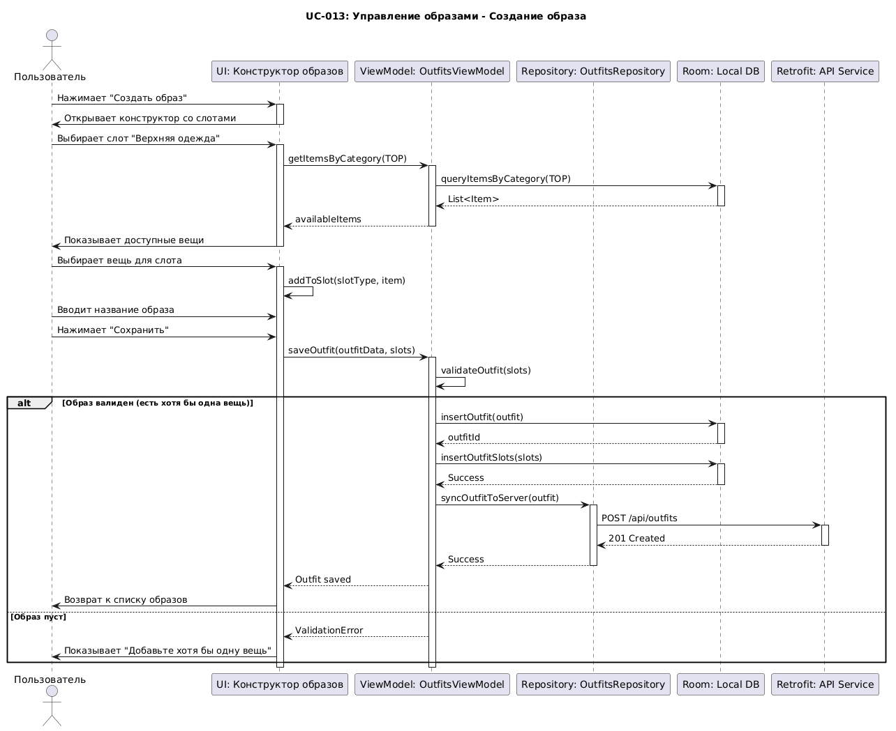
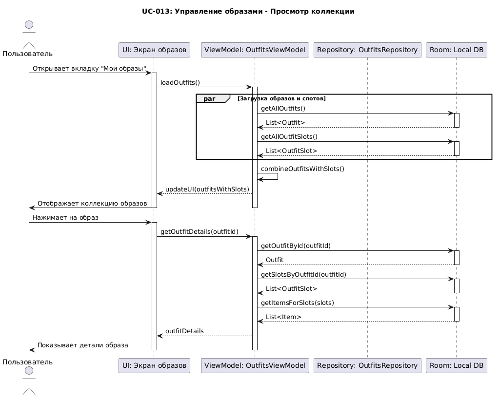
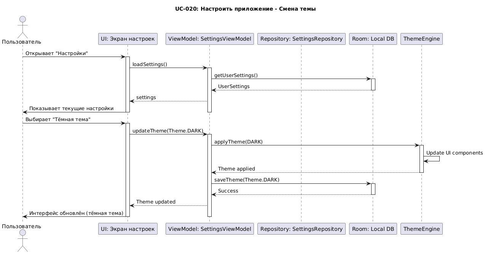
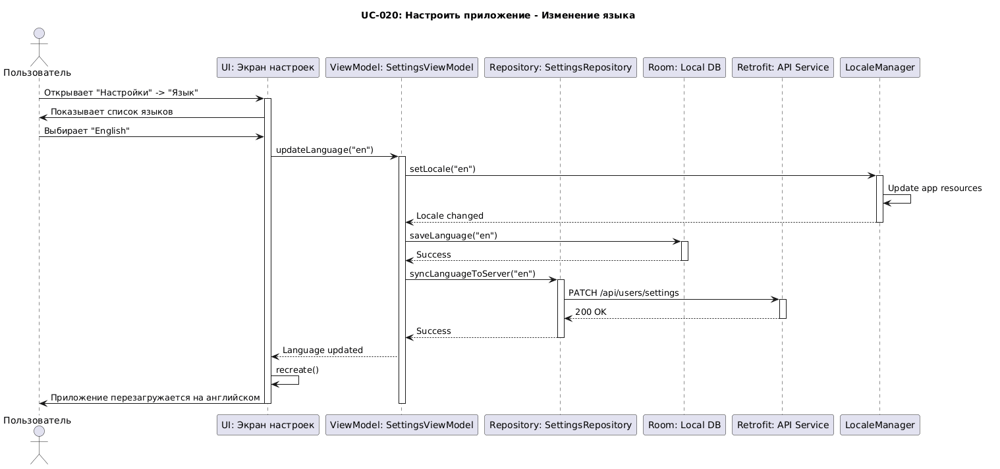
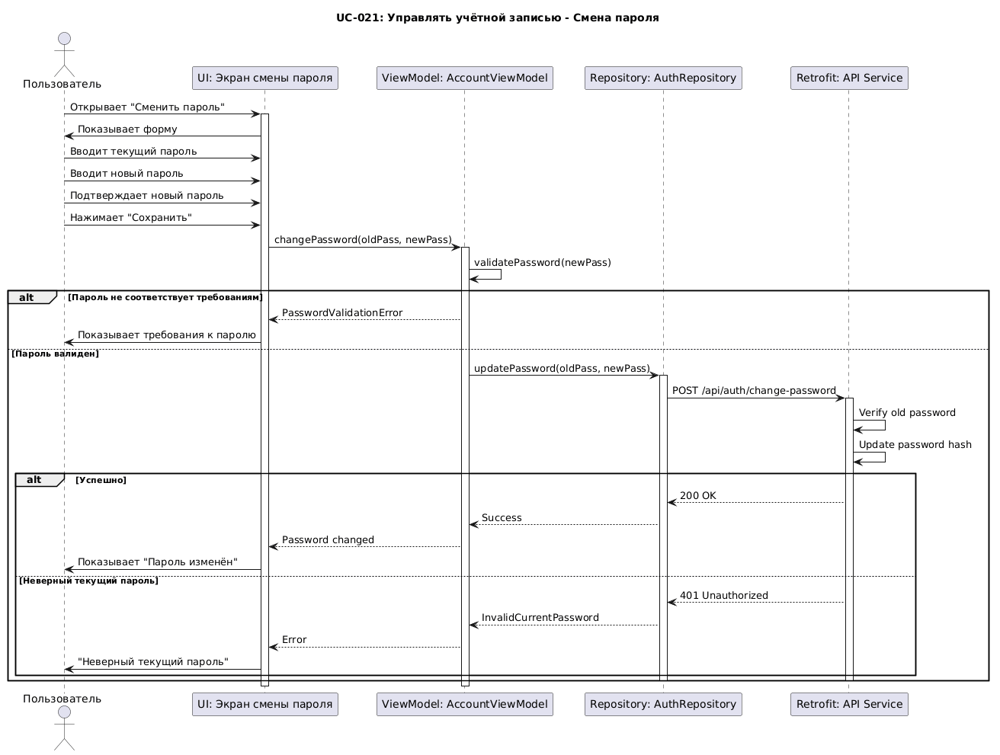
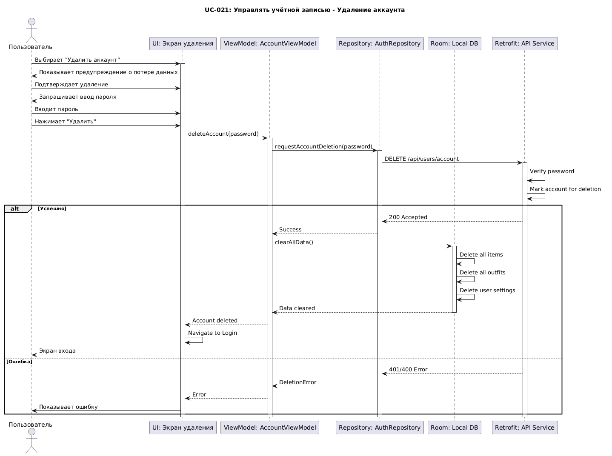
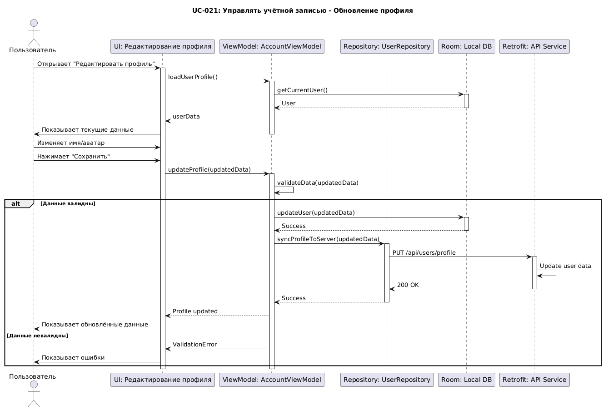

# Диаграммы последовательности основных прецедентов

## UC-005: Управление вещами - Добавление новой вещи


## UC-005: Управление вещами - Просмотр с фильтрацией


## UC-013: Управление образами - Создание образа


## UC-013: Управление образами - Просмотр коллекции


## UC-020: Настроить приложение - Смена темы


## UC-020: Настроить приложение - Изменение языка


## UC-021: Управлять учётной записью - Смена пароля


## UC-021: Управлять учётной записью - Удаление аккаунта


## UC-021: Управлять учётной записью - Обновление профиля


# Пояснение

#### Основные элементы диаграмм:
**Участники (Lifelines):**
- **Actor** - Пользователь приложения
- **UI** - Boundary объекты (Activity/Fragment/Composable)
- **ViewModel** - Control объекты (управление состоянием)
- **Repository** - Посредники между ViewModel и источниками данных
- **LocalDB** - Room database (локальное хранилище)
- **API** - Retrofit service (сетевые запросы)
- **Theme/Locale** - Системные компоненты

**Обозначения:**
- Сплошные стрелки → - Синхронные вызовы
- Пунктирные стрелки --> - Возврат значений
- activate/deactivate - Период активности участника
- alt/else - Условные ветвления
- par - Параллельное выполнение
- loop - Циклы

# Код диаграмм

## UC-005: Управление вещами - Добавление новой вещи
```
@startuml
title UC-005: Управление вещами - Добавление новой вещи

actor "Пользователь" as User
participant "UI: Экран вещей" as UI
participant "ViewModel: ItemsViewModel" as VM
participant "Repository: ItemsRepository" as Repo
participant "Room: Local DB" as LocalDB
participant "Retrofit: API Service" as API

User -> UI : Нажимает "Добавить вещь"
activate UI
UI -> User : Открывает форму добавления
deactivate UI

User -> UI : Заполняет данные (фото, название, категория)
User -> UI : Нажимает "Сохранить"
activate UI

UI -> VM : saveItem(itemData)
activate VM

VM -> VM : Валидация данных
alt Данные валидны
    VM -> LocalDB : insertItem(item)
    activate LocalDB
    LocalDB --> VM : itemId
    deactivate LocalDB
    
    VM -> Repo : syncItemToServer(item)
    activate Repo
    Repo -> API : POST /api/items
    activate API
    API --> Repo : 201 Created
    deactivate API
    Repo --> VM : Success
    deactivate Repo
    
    VM --> UI : Item saved successfully
    UI -> User : Показывает список с новой вещью
else Данные невалидны
    VM --> UI : ValidationError
    UI -> User : Показывает ошибки валидации
end

deactivate VM
deactivate UI
@enduml
```

## UC-005: Управление вещами - Просмотр с фильтрацией
```
@startuml
title UC-005: Управление вещами - Просмотр с фильтрацией

actor "Пользователь" as User
participant "UI: Экран вещей" as UI
participant "ViewModel: ItemsViewModel" as VM
participant "Repository: ItemsRepository" as Repo
participant "Room: Local DB" as LocalDB

User -> UI : Открывает вкладку "Мои вещи"
activate UI

UI -> VM : loadItems()
activate VM

VM -> LocalDB : getAllItems()
activate LocalDB
LocalDB --> VM : List<Item>
deactivate LocalDB

VM --> UI : updateUI(items)
UI -> User : Отображает список вещей
deactivate VM
deactivate UI

User -> UI : Выбирает фильтр "Сезон: Зима"
activate UI
UI -> VM : filterItems(season=WINTER)
activate VM

VM -> LocalDB : getItemsBySeason(WINTER)
activate LocalDB
LocalDB --> VM : FilteredList<Item>
deactivate LocalDB

VM --> UI : updateUI(filteredItems)
UI -> User : Показывает только зимние вещи
deactivate VM
deactivate UI
@enduml
```

## UC-013: Управление образами - Создание образа
```
@startuml
title UC-013: Управление образами - Создание образа

actor "Пользователь" as User
participant "UI: Конструктор образов" as UI
participant "ViewModel: OutfitsViewModel" as VM
participant "Repository: OutfitsRepository" as Repo
participant "Room: Local DB" as LocalDB
participant "Retrofit: API Service" as API

User -> UI : Нажимает "Создать образ"
activate UI
UI -> User : Открывает конструктор со слотами
deactivate UI

User -> UI : Выбирает слот "Верхняя одежда"
activate UI
UI -> VM : getItemsByCategory(TOP)
activate VM
VM -> LocalDB : queryItemsByCategory(TOP)
activate LocalDB
LocalDB --> VM : List<Item>
deactivate LocalDB
VM --> UI : availableItems
deactivate VM
UI -> User : Показывает доступные вещи
deactivate UI

User -> UI : Выбирает вещь для слота
activate UI
UI -> UI : addToSlot(slotType, item)

User -> UI : Вводит название образа
User -> UI : Нажимает "Сохранить"

UI -> VM : saveOutfit(outfitData, slots)
activate VM

VM -> VM : validateOutfit(slots)
alt Образ валиден (есть хотя бы одна вещь)
    VM -> LocalDB : insertOutfit(outfit)
    activate LocalDB
    LocalDB --> VM : outfitId
    deactivate LocalDB
    
    VM -> LocalDB : insertOutfitSlots(slots)
    activate LocalDB
    LocalDB --> VM : Success
    deactivate LocalDB
    
    VM -> Repo : syncOutfitToServer(outfit)
    activate Repo
    Repo -> API : POST /api/outfits
    activate API
    API --> Repo : 201 Created
    deactivate API
    Repo --> VM : Success
    deactivate Repo
    
    VM --> UI : Outfit saved
    UI -> User : Возврат к списку образов
else Образ пуст
    VM --> UI : ValidationError
    UI -> User : Показывает "Добавьте хотя бы одну вещь"
end

deactivate VM
deactivate UI
@enduml
```

## UC-013: Управление образами - Просмотр коллекции
```
@startuml
title UC-013: Управление образами - Просмотр коллекции

actor "Пользователь" as User
participant "UI: Экран образов" as UI
participant "ViewModel: OutfitsViewModel" as VM
participant "Repository: OutfitsRepository" as Repo
participant "Room: Local DB" as LocalDB

User -> UI : Открывает вкладку "Мои образы"
activate UI

UI -> VM : loadOutfits()
activate VM

par Загрузка образов и слотов
    VM -> LocalDB : getAllOutfits()
    activate LocalDB
    LocalDB --> VM : List<Outfit>
    deactivate LocalDB
    VM -> LocalDB : getAllOutfitSlots()
    activate LocalDB
    LocalDB --> VM : List<OutfitSlot>
    deactivate LocalDB
end

VM -> VM : combineOutfitsWithSlots()
VM --> UI : updateUI(outfitsWithSlots)
UI -> User : Отображает коллекцию образов
deactivate VM
deactivate UI

User -> UI : Нажимает на образ
activate UI
UI -> VM : getOutfitDetails(outfitId)
activate VM

VM -> LocalDB : getOutfitById(outfitId)
activate LocalDB
LocalDB --> VM : Outfit
deactivate LocalDB

VM -> LocalDB : getSlotsByOutfitId(outfitId)
activate LocalDB
LocalDB --> VM : List<OutfitSlot>
deactivate LocalDB

VM -> LocalDB : getItemsForSlots(slots)
activate LocalDB
LocalDB --> VM : List<Item>
deactivate LocalDB

VM --> UI : outfitDetails
UI -> User : Показывает детали образа
deactivate VM
deactivate UI
@enduml
```

## UC-020: Настроить приложение - Смена темы
```
@startuml
title UC-020: Настроить приложение - Смена темы

actor "Пользователь" as User
participant "UI: Экран настроек" as UI
participant "ViewModel: SettingsViewModel" as VM
participant "Repository: SettingsRepository" as Repo
participant "Room: Local DB" as LocalDB
participant "ThemeEngine" as Theme

User -> UI : Открывает "Настройки"
activate UI
UI -> VM : loadSettings()
activate VM

VM -> LocalDB : getUserSettings()
activate LocalDB
LocalDB --> VM : UserSettings
deactivate LocalDB

VM --> UI : settings
UI -> User : Показывает текущие настройки
deactivate VM
deactivate UI

User -> UI : Выбирает "Тёмная тема"
activate UI
UI -> VM : updateTheme(Theme.DARK)
activate VM

VM -> Theme : applyTheme(DARK)
activate Theme
Theme -> Theme : Update UI components
Theme --> VM : Theme applied
deactivate Theme

VM -> LocalDB : saveTheme(Theme.DARK)
activate LocalDB
LocalDB --> VM : Success
deactivate LocalDB

VM --> UI : Theme updated
UI -> User : Интерфейс обновлён (тёмная тема)
deactivate VM
deactivate UI
@enduml
```

## UC-020: Настроить приложение - Изменение языка
```
@startuml
title UC-020: Настроить приложение - Изменение языка

actor "Пользователь" as User
participant "UI: Экран настроек" as UI
participant "ViewModel: SettingsViewModel" as VM
participant "Repository: SettingsRepository" as Repo
participant "Room: Local DB" as LocalDB
participant "Retrofit: API Service" as API
participant "LocaleManager" as Locale

User -> UI : Открывает "Настройки" -> "Язык"
activate UI
UI -> User : Показывает список языков

User -> UI : Выбирает "English"
UI -> VM : updateLanguage("en")
activate VM

VM -> Locale : setLocale("en")
activate Locale
Locale -> Locale : Update app resources
Locale --> VM : Locale changed
deactivate Locale

VM -> LocalDB : saveLanguage("en")
activate LocalDB
LocalDB --> VM : Success
deactivate LocalDB

VM -> Repo : syncLanguageToServer("en")
activate Repo
Repo -> API : PATCH /api/users/settings
activate API
API --> Repo : 200 OK
deactivate API
Repo --> VM : Success
deactivate Repo

VM --> UI : Language updated
UI -> UI : recreate()
UI -> User : Приложение перезагружается на английском
deactivate VM
deactivate UI
@enduml
```

## UC-021: Управлять учётной записью - Смена пароля
```
@startuml
title UC-021: Управлять учётной записью - Смена пароля

actor "Пользователь" as User
participant "UI: Экран смены пароля" as UI
participant "ViewModel: AccountViewModel" as VM
participant "Repository: AuthRepository" as Repo
participant "Retrofit: API Service" as API

User -> UI : Открывает "Сменить пароль"
activate UI
UI -> User : Показывает форму

User -> UI : Вводит текущий пароль
User -> UI : Вводит новый пароль
User -> UI : Подтверждает новый пароль
User -> UI : Нажимает "Сохранить"

UI -> VM : changePassword(oldPass, newPass)
activate VM

VM -> VM : validatePassword(newPass)
alt Пароль не соответствует требованиям
    VM --> UI : PasswordValidationError
    UI -> User : Показывает требования к паролю
else Пароль валиден
    VM -> Repo : updatePassword(oldPass, newPass)
    activate Repo
    
    Repo -> API : POST /api/auth/change-password
    activate API
    API -> API : Verify old password
    API -> API : Update password hash
    
    alt Успешно
        API --> Repo : 200 OK
        Repo --> VM : Success
        VM --> UI : Password changed
        UI -> User : Показывает "Пароль изменён"
    else Неверный текущий пароль
        API --> Repo : 401 Unauthorized
        Repo --> VM : InvalidCurrentPassword
        VM --> UI : Error
        UI -> User : "Неверный текущий пароль"
    end
    
    deactivate API
    deactivate Repo
end

deactivate VM
deactivate UI
@enduml
```

## UC-021: Управлять учётной записью - Удаление аккаунта
```
@startuml
title UC-021: Управлять учётной записью - Удаление аккаунта

actor "Пользователь" as User
participant "UI: Экран удаления" as UI
participant "ViewModel: AccountViewModel" as VM
participant "Repository: AuthRepository" as Repo
participant "Room: Local DB" as LocalDB
participant "Retrofit: API Service" as API

User -> UI : Выбирает "Удалить аккаунт"
activate UI

UI -> User : Показывает предупреждение о потере данных
User -> UI : Подтверждает удаление
UI -> User : Запрашивает ввод пароля

User -> UI : Вводит пароль
User -> UI : Нажимает "Удалить"

UI -> VM : deleteAccount(password)
activate VM

VM -> Repo : requestAccountDeletion(password)
activate Repo

Repo -> API : DELETE /api/users/account
activate API
API -> API : Verify password
API -> API : Mark account for deletion

alt Успешно
    API --> Repo : 200 Accepted
    Repo --> VM : Success
    
    VM -> LocalDB : clearAllData()
    activate LocalDB
    LocalDB -> LocalDB : Delete all items
    LocalDB -> LocalDB : Delete all outfits
    LocalDB -> LocalDB : Delete user settings
    LocalDB --> VM : Data cleared
    deactivate LocalDB
    
    VM --> UI : Account deleted
    UI -> UI : Navigate to Login
    UI -> User : Экран входа
else Ошибка
    API --> Repo : 401/400 Error
    Repo --> VM : DeletionError
    VM --> UI : Error
    UI -> User : Показывает ошибку
end

deactivate API
deactivate Repo
deactivate VM
deactivate UI
@enduml
```

## UC-021: Управлять учётной записью - Обновление профиля
```
@startuml
title UC-021: Управлять учётной записью - Обновление профиля

actor "Пользователь" as User
participant "UI: Редактирование профиля" as UI
participant "ViewModel: AccountViewModel" as VM
participant "Repository: UserRepository" as Repo
participant "Room: Local DB" as LocalDB
participant "Retrofit: API Service" as API

User -> UI : Открывает "Редактировать профиль"
activate UI

UI -> VM : loadUserProfile()
activate VM
VM -> LocalDB : getCurrentUser()
activate LocalDB
LocalDB --> VM : User
deactivate LocalDB
VM --> UI : userData
UI -> User : Показывает текущие данные
deactivate VM

User -> UI : Изменяет имя/аватар
User -> UI : Нажимает "Сохранить"

UI -> VM : updateProfile(updatedData)
activate VM

VM -> VM : validateData(updatedData)
alt Данные валидны
    VM -> LocalDB : updateUser(updatedData)
    activate LocalDB
    LocalDB --> VM : Success
    deactivate LocalDB
    
    VM -> Repo : syncProfileToServer(updatedData)
    activate Repo
    Repo -> API : PUT /api/users/profile
    activate API
    API -> API : Update user data
    API --> Repo : 200 OK
    deactivate API
    Repo --> VM : Success
    deactivate Repo
    
    VM --> UI : Profile updated
    UI -> User : Показывает обновлённые данные
else Данные невалидны
    VM --> UI : ValidationError
    UI -> User : Показывает ошибки
end

deactivate VM
deactivate UI
@enduml
```