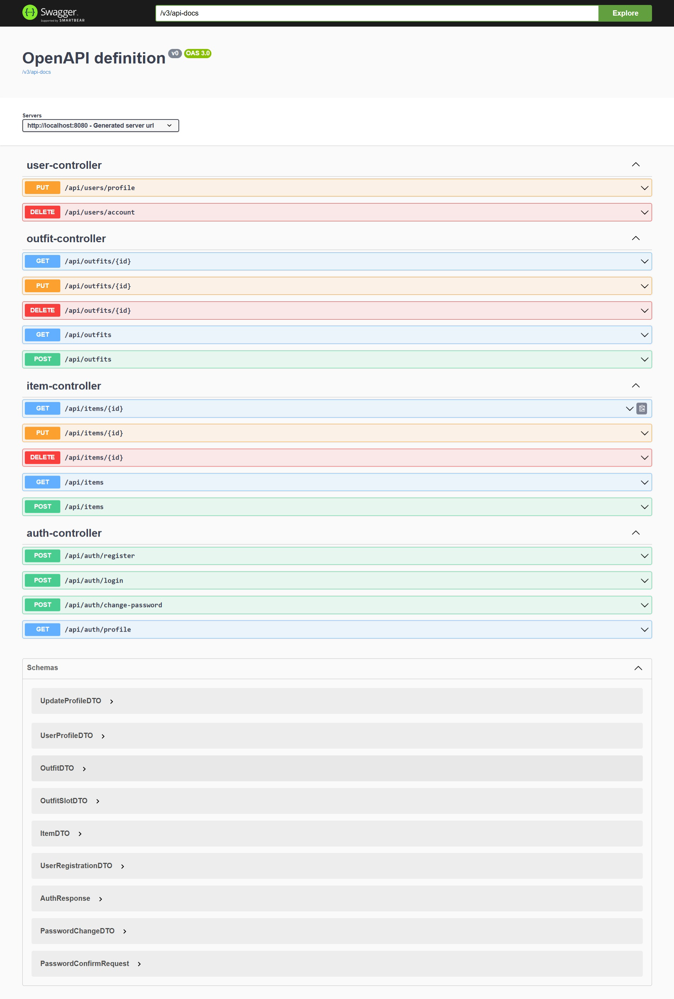

# Документация API

## Swagger UI

API документация доступна через интерактивный Swagger UI интерфейс после запуска сервера.

### Доступ к Swagger UI

После запуска приложения в Docker откройте в браузере:
```
http://localhost:8080/swagger-ui.html
```

### OpenAPI JSON Specification

Полная OpenAPI спецификация доступна по адресу:
```
http://localhost:8080/v3/api-docs
```

## Endpoints

Все доступные endpoints, их параметры и примеры ответов описаны в интерактивном Swagger UI.

### Скриншот Swagger UI



## Для разработчиков

- **Swagger Configuration**: `my-shelf-server/src/main/java/com/example/config/SwaggerConfig.java`
- **Swagger Dependency**: Используется `springdoc-openapi-starter-webmvc-ui v2.2.0`
- **Документирование API методов**: Используйте аннотации `@Operation`, `@RequestBody`, `@Parameter` из пакета `io.swagger.v3.oas.annotations`

### Пример аннотирования метода:

```java
@GetMapping("/{id}")
@Operation(summary = "Получить элемент по ID", 
           description = "Возвращает элемент гардероба по заданному ID")
public ResponseEntity<ItemDTO> getItem(@PathVariable Long id) {
    // implementation
}
```
