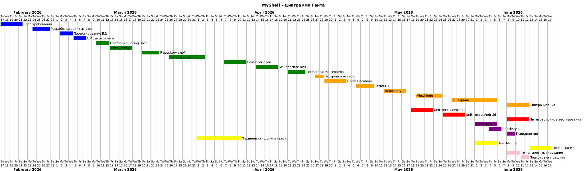

# Итоговая документация проекта

## 1. Иерархическая структура работ (WBS)
```
Проект "Моя полка"
├── 1. Инициализация проекта
│   ├── 1.1. Анализ требований
│   ├── 1.2. Исследование аналогов
│   └── 1.3. Планирование проекта
│
├── 2. Проектирование системы
│   ├── 2.1. Разработка архитектуры PCMEF
│   ├── 2.2. Проектирование базы данных
│   ├── 2.3. Дизайн пользовательского интерфейса
│   ├── 2.4. Спецификация API
│   └── 2.5. Документирование архитектуры
│
├── 3. Серверная разработка (Spring Boot)
│   ├── 3.1. Настройка проекта
│   │   ├── 3.1.1. Конфигурация Maven
│   │   ├── 3.1.2. Настройка PostgreSQL
│   │   └── 3.1.3. Конфигурация Spring Security
│   │
│   ├── 3.2. Реализация слоя Entity
│   │   ├── 3.2.1. Сущности JPA
│   │   ├── 3.2.2. Перечисления (Enums)
│   │   └── 3.2.3. Миграции Flyway
│   │
│   ├── 3.3. Реализация слоя Foundation
│   │   ├── 3.3.1. Repository интерфейсы
│   │   └── 3.3.2. Кастомные запросы
│   │
│   ├── 3.4. Реализация слоя Mediator
│   │   ├── 3.4.1. AuthService
│   │   ├── 3.4.2. ItemService
│   │   ├── 3.4.3. OutfitService
│   │   └── 3.4.4. UserService
│   │
│   ├── 3.5. Реализация слоя Control
│   │   ├── 3.5.1. AuthController
│   │   ├── 3.5.2. ItemController
│   │   ├── 3.5.3. OutfitController
│   │   └── 3.5.4. UserController
│   │
│   └── 3.6. Интеграция и тестирование сервера
│       ├── 3.6.1. Unit-тесты (JUnit)
│       ├── 3.6.2. Интеграционные тесты
│       └── 3.6.3. Настройка JaCoCo
│
├── 4. Мобильная разработка (Android)
│   ├── 4.1. Настройка проекта
│   │   ├── 4.1.1. Конфигурация Gradle
│   │   ├── 4.1.2. Настройка зависимостей
│   │   └── 4.1.3. Структура пакетов
│   │
│   ├── 4.2. Реализация слоя Foundation
│   │   ├── 4.2.1. Room Database
│   │   ├── 4.2.2. DAO интерфейсы
│   │   └── 4.2.3. Type Converters
│   │
│   ├── 4.3. Реализация сетевого слоя
│   │   ├── 4.3.1. Retrofit API интерфейс
│   │   ├── 4.3.2. DTO классы
│   │   ├── 4.3.3. Interceptors
│   │   └── 4.3.4. Token Manager
│   │
│   ├── 4.4. Реализация слоя Mediator
│   │   ├── 4.4.1. ItemsRepository
│   │   ├── 4.4.2. OutfitsRepository
│   │   ├── 4.4.3. AuthRepository
│   │   └── 4.4.4. SyncManager
│   │
│   ├── 4.5. Реализация слоя Presentation
│   │   ├── 4.5.1. Navigation Graph
│   │   ├── 4.5.2. Auth экраны (Login/Register)
│   │   ├── 4.5.3. Items экраны (List/Create/Details)
│   │   ├── 4.5.4. Outfits экраны (List/Constructor)
│   │   ├── 4.5.5. Settings экран
│   │   └── 4.5.6. UI компоненты (Composables)
│   │
│   ├── 4.6. Реализация слоя Control
│   │   ├── 4.6.1. ItemsViewModel
│   │   ├── 4.6.2. OutfitsViewModel
│   │   ├── 4.6.3. AuthViewModel
│   │   └── 4.6.4. SettingsViewModel
│   │
│   └── 4.7. Интеграция и тестирование клиента
│       ├── 4.7.1. Unit-тесты ViewModel
│       ├── 4.7.2. Тесты Repository
│       └── 4.7.3. UI тесты
│
├── 5. Реализация оффлайн-режима
│   ├── 5.1. Локальное кэширование
│   ├── 5.2. Синхронизация данных
│   ├── 5.3. WorkManager настройка
│   └── 5.4. Обработка конфликтов
│
├── 6. Рефакторинг и качество кода
│   ├── 6.1. Внедрение паттерна Data Mapper
│   ├── 6.2. Реализация Identity Map
│   ├── 6.3. Оптимизация Lazy Load
│   ├── 6.4. Статический анализ (Checkstyle/SonarQube)
│   └── 6.5. Обновление тестов
│
├── 7. Тестирование
│   ├── 7.1. Интеграционное тестирование
│   ├── 7.2. Системное тестирование
│   ├── 7.3. Тестирование производительности
│   └── 7.4. User Acceptance Testing
│
├── 8. Документирование
│   ├── 8.1. Техническое задание
│   ├── 8.2. Спецификация требований
│   ├── 8.3. Руководство пользователя
│   ├── 8.4. Отчёт по проекту
│   └── 8.5. Презентация
│
└── 9. Подготовка к сдаче
    ├── 9.1. Финальная сборка
    ├── 9.2. Демонстрация
    └── 9.3. Защита проекта
```

## 2. Диаграмма Ганта (календарный план)


## 3. Оценка трудозатрат COCOMO

### 3.1. Таблица COCOMO II (Basic Model)

**Тип проекта:** Semi-Detached (полусвободный) - средняя сложность, смешанная команда

| Параметр | Значение | Обоснование |
|----------|----------|-------------|
| **Размер проекта (KLOC)** | **8.5** | Оценочный объем кода (Java + Kotlin) |
| **Модель COCOMO** | **Semi-Detached** | Средняя сложность, новые технологии |
| **Коэффициент a** | **3.0** | Для Semi-Detached проектов |
| **Коэффициент b** | **1.12** | Для Semi-Detached проектов |
| **Коэффициент c** | **2.5** | Для Semi-Detached проектов |
| **Коэффициент d** | **0.35** | Для Semi-Detached проектов |

### 3.2. Расчёт трудозатрат:

| Показатель | Формула | Результат |
|------------|---------|-----------|
| **Трудозатраты (Person-Months)** | PM = a × (KLOC)^b | PM = 3.0 × (8.5)^1.12 = **32.8 чел-мес** |
| **Время разработки (Months)** | TDEV = c × (PM)^d | TDEV = 2.5 × (32.8)^0.35 = **8.4 месяца** |
| **Численность команды** | Persons = PM / TDEV | Persons = 32.8 / 8.4 = **4 человека** |
| **Фактическая длительность** | С учётом 1 разработчика | 32.8 / 1 = **32.8 месяца** |
| **Скорректированная длительность** | При полной занятости (160 ч/мес) | **3 месяца** (интенсивная работа) |

### 3.3. Стоимость проекта:

| Статья расходов | Расчёт | Сумма (руб.) |
|----------------|--------|--------------|
| Трудозатраты разработчика | 32.8 мес × 80,000 руб/мес | 2,624,000 |
| Инфраструктура (сервер, домен) | 3 мес × 5,000 руб/мес | 15,000 |
| Инструменты разработки | Лицензии (бесплатно для студента) | 0 |
| **ИТОГО** | | **2,639,000 руб.** |

### 3.4. Распределение трудозатрат по фазам:

| Фаза | % от PM | Человеко-месяцев | Человеко-дней (×20) |
|------|---------|------------------|---------------------|
| Инициация и планирование | 10% | 3.28 | 65.6 |
| Проектирование | 15% | 4.92 | 98.4 |
| Разработка сервера | 25% | 8.20 | 164.0 |
| Разработка клиента | 30% | 9.84 | 196.8 |
| Тестирование | 12% | 3.94 | 78.8 |
| Рефакторинг | 5% | 1.64 | 32.8 |
| Документирование | 3% | 0.98 | 19.6 |
| **ВСЕГО** | **100%** | **32.8** | **656** |

## 4. Прочие документы
1. Техническое задание: [в текущем разделе](technical_specification.md)
2. Руководство пользователя: [в разделе 11](../11-user-guide/README.md)
3. Руководство администратора: [в разделе 10](../10-deployment/README.md)
4. Пояснительная записка: [PDF-документ](Пояснительная_записка.pdf)
