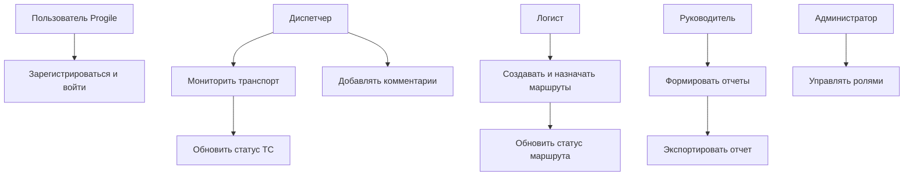

# BUC-диаграмма

```mermaid
flowchart TB
    actor["Пользователь Progile"] --> auth["Зарегистрироваться и войти"]
    dispatcher["Диспетчер"] --> monitor["Мониторить транспорт"]
    dispatcher --> comment["Добавлять комментарии"]
    logist["Логист"] --> route["Создавать и назначать маршруты"]
    manager["Руководитель"] --> report["Формировать отчеты"]
    admin["Администратор"] --> users["Управлять ролями"]
    monitor --> status["Обновить статус ТС"]
    route --> statusRoute["Обновить статус маршрута"]
    report --> export["Экспортировать отчет"]
```
