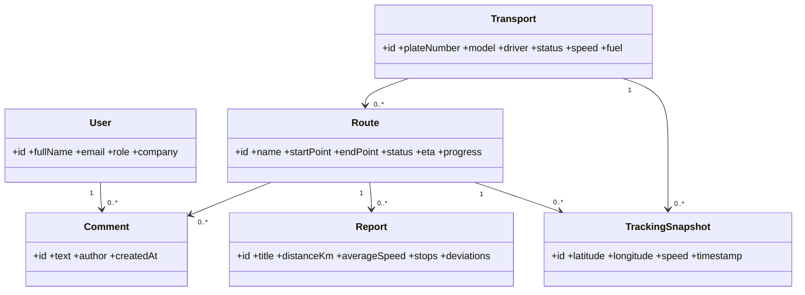

# Бизнес-модель классов

```mermaid
classDiagram
    class User { +id +fullName +email +role +company }
    class Transport { +id +plateNumber +model +driver +status +speed +fuel }
    class Route { +id +name +startPoint +endPoint +status +eta +progress }
    class TrackingSnapshot { +id +latitude +longitude +speed +timestamp }
    class Report { +id +title +distanceKm +averageSpeed +stops +deviations }
    class Comment { +id +text +author +createdAt }
    User "1" --> "0..*" Comment
    Transport "1" --> "0..*" TrackingSnapshot
    Transport "1" --> "0..*" Route
    Route "1" --> "0..*" TrackingSnapshot
    Route "1" --> "0..*" Report
    Route "1" --> "0..*" Comment
```
