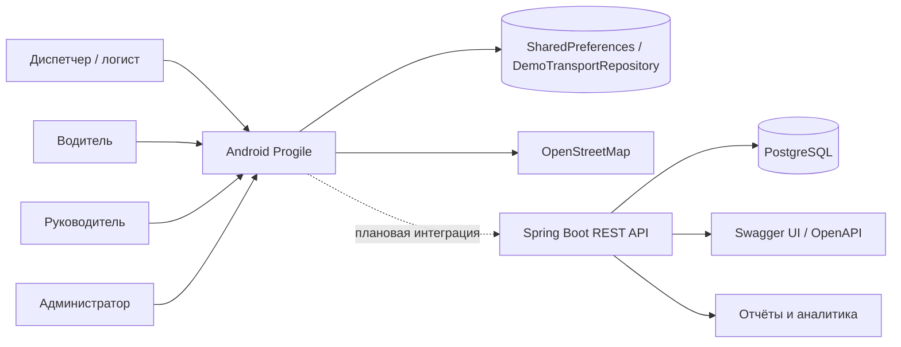

# Контекстная диаграмма

Текущий Android-прототип автономен: локальная учётная запись, транспорт и маршруты не требуют сервера. Backend реализует промышленный REST-контракт, JWT, роли и PostgreSQL и подготовлен к подключению через реализацию интерфейса `TransportRepository`.
