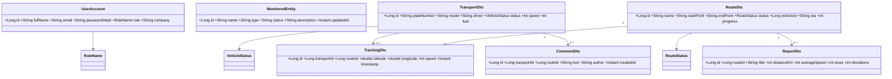

# Domain model

```mermaid
classDiagram
    class UserAccount { +Long id +String fullName +String email +String passwordHash +RoleName role +String company }
    class MonitoredEntity { +Long id +String name +String type +String status +String description +Instant updatedAt }
    class TransportDto { +Long id +String plateNumber +String model +String driver +VehicleStatus status +int speed +int fuel }
    class RouteDto { +Long id +String name +String startPoint +String endPoint +RouteStatus status +Long vehicleId +String eta +int progress }
    class TrackingDto { +Long id +Long transportId +Long routeId +double latitude +double longitude +int speed +Instant timestamp }
    class ReportDto { +Long id +Long routeId +String title +int distanceKm +int averageSpeed +int stops +int deviations }
    class CommentDto { +Long id +Long transportId +Long routeId +String text +String author +Instant createdAt }
    UserAccount --> RoleName
    TransportDto --> VehicleStatus
    RouteDto --> RouteStatus
    TransportDto "1" --> "0..*" TrackingDto
    RouteDto "1" --> "0..*" TrackingDto
    RouteDto "1" --> "0..*" ReportDto
    TransportDto "1" --> "0..*" CommentDto
```

`MonitoredEntity` оставлена как обязательная универсальная сущность КП для `/api/entities`.
