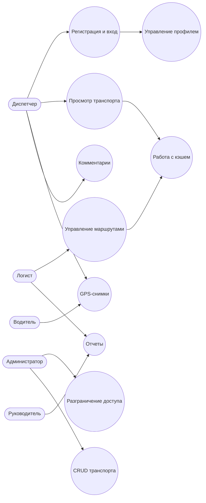

# Use-case diagram

```mermaid
flowchart LR
    dispatcher([Диспетчер])
    logist([Логист])
    admin([Администратор])
    manager([Руководитель])
    driver([Водитель])
    auth((Регистрация и вход))
    profile((Управление профилем))
    vehicles((Просмотр транспорта))
    vehicleCrud((CRUD транспорта))
    routes((Управление маршрутами))
    tracking((GPS-снимки))
    reports((Отчеты))
    comments((Комментарии))
    offline((Работа с кэшем))
    users((Разграничение доступа))
    dispatcher --> auth
    dispatcher --> vehicles
    dispatcher --> tracking
    dispatcher --> comments
    logist --> routes
    logist --> reports
    admin --> users
    admin --> vehicleCrud
    manager --> reports
    driver --> tracking
    auth --> profile
    vehicles --> offline
    routes --> offline
```
