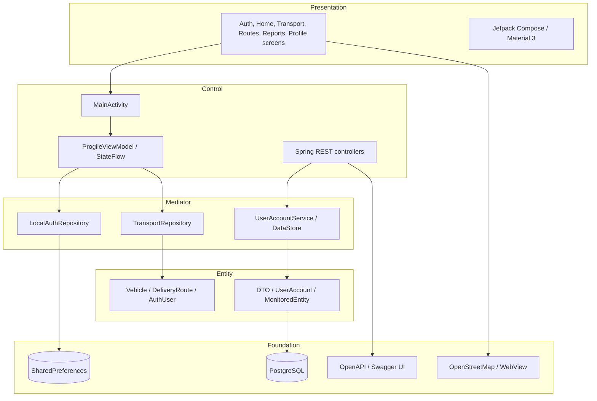

# PCMEF-диаграмма

```mermaid
flowchart TB
    subgraph P[Presentation]
      screens["Auth, Home, Transport, Routes, Reports, Profile screens"]
      material["Jetpack Compose / Material 3"]
    end
    subgraph C[Control]
      activity["MainActivity"]
      viewModel["ProgileViewModel / StateFlow"]
      controllers["Spring REST controllers"]
    end
    subgraph M[Mediator]
      authRepo["LocalAuthRepository"]
      transportRepo["TransportRepository"]
      services["UserAccountService / DataStore"]
    end
    subgraph E[Entity]
      kotlinModels["Vehicle / DeliveryRoute / AuthUser"]
      javaModels["DTO / UserAccount / MonitoredEntity"]
    end
    subgraph F[Foundation]
      prefs[("SharedPreferences")]
      osm["OpenStreetMap / WebView"]
      postgres[("PostgreSQL")]
      swagger["OpenAPI / Swagger UI"]
    end
    screens --> activity --> viewModel
    viewModel --> authRepo --> prefs
    viewModel --> transportRepo --> kotlinModels
    screens --> osm
    controllers --> services --> javaModels --> postgres
    controllers --> swagger
```
