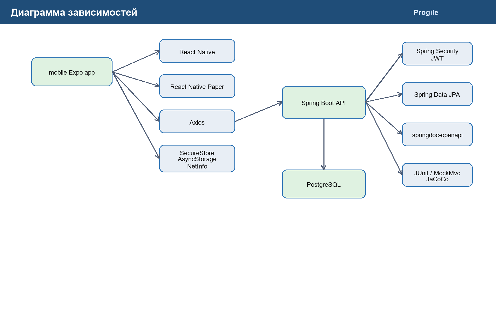
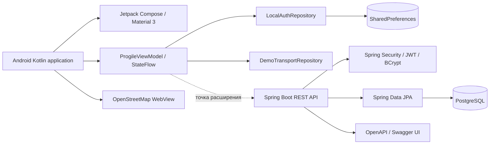

# Диаграмма зависимостей

Исходное описание диаграммы в формате Mermaid:

Текущая Android-сборка работает как автономный прототип. Серверный API находится в папке `backend` и подготовлен для последующей замены демонстрационного репозитория сетевой реализацией.
