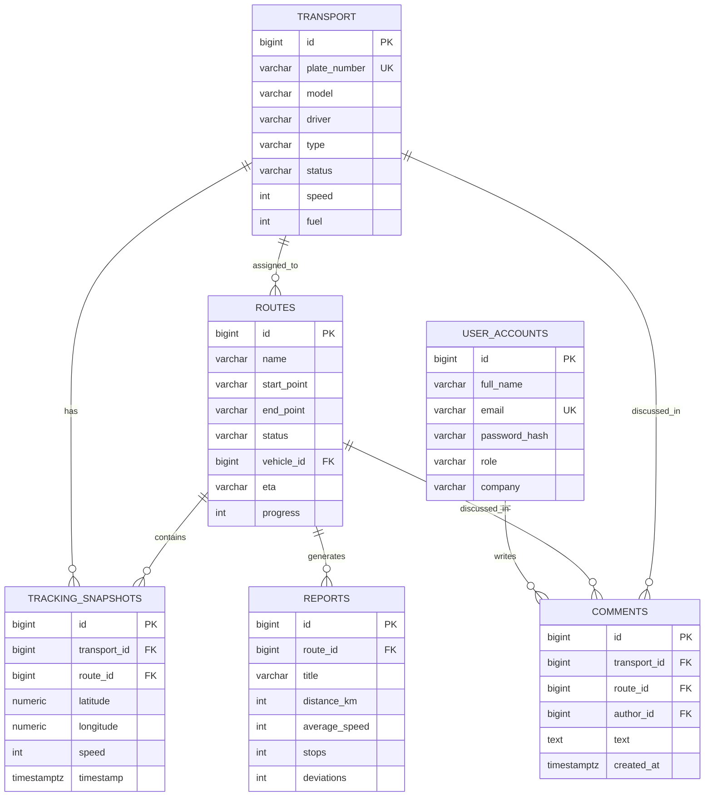

# ER-диаграмма

```mermaid
erDiagram
    USER_ACCOUNTS ||--o{ COMMENTS : writes
    TRANSPORT ||--o{ ROUTES : assigned_to
    TRANSPORT ||--o{ TRACKING_SNAPSHOTS : has
    ROUTES ||--o{ TRACKING_SNAPSHOTS : contains
    ROUTES ||--o{ REPORTS : generates
    ROUTES ||--o{ COMMENTS : discussed_in
    TRANSPORT ||--o{ COMMENTS : discussed_in
    USER_ACCOUNTS { bigint id PK varchar full_name varchar email UK varchar password_hash varchar role varchar company }
    TRANSPORT { bigint id PK varchar plate_number UK varchar model varchar driver varchar type varchar status int speed int fuel }
    ROUTES { bigint id PK varchar name varchar start_point varchar end_point varchar status bigint vehicle_id FK varchar eta int progress }
    TRACKING_SNAPSHOTS { bigint id PK bigint transport_id FK bigint route_id FK numeric latitude numeric longitude int speed timestamptz timestamp }
    REPORTS { bigint id PK bigint route_id FK varchar title int distance_km int average_speed int stops int deviations }
    COMMENTS { bigint id PK bigint transport_id FK bigint route_id FK bigint author_id FK text text timestamptz created_at }
```
