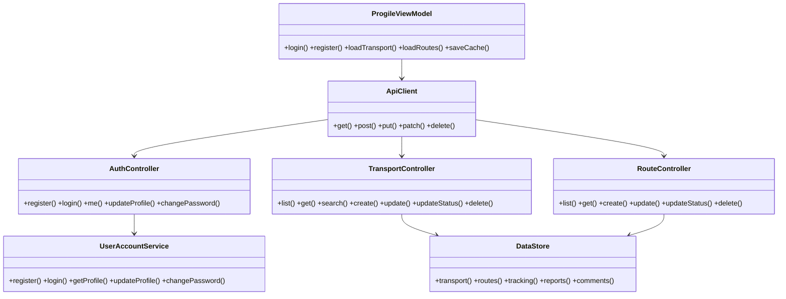

# Диаграмма классов проектирования

```mermaid
classDiagram
    class ProgileViewModel { +login() +register() +loadTransport() +loadRoutes() +saveCache() }
    class ApiClient { +get() +post() +put() +patch() +delete() }
    class AuthController { +register() +login() +me() +updateProfile() +changePassword() }
    class TransportController { +list() +get() +search() +create() +update() +updateStatus() +delete() }
    class RouteController { +list() +get() +create() +update() +updateStatus() +delete() }
    class DataStore { +transport() +routes() +tracking() +reports() +comments() }
    class UserAccountService { +register() +login() +getProfile() +updateProfile() +changePassword() }
    ProgileViewModel --> ApiClient
    ApiClient --> AuthController
    ApiClient --> TransportController
    ApiClient --> RouteController
    AuthController --> UserAccountService
    TransportController --> DataStore
    RouteController --> DataStore
```
