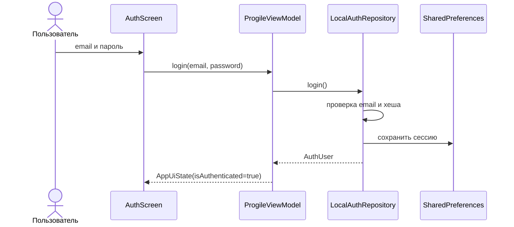
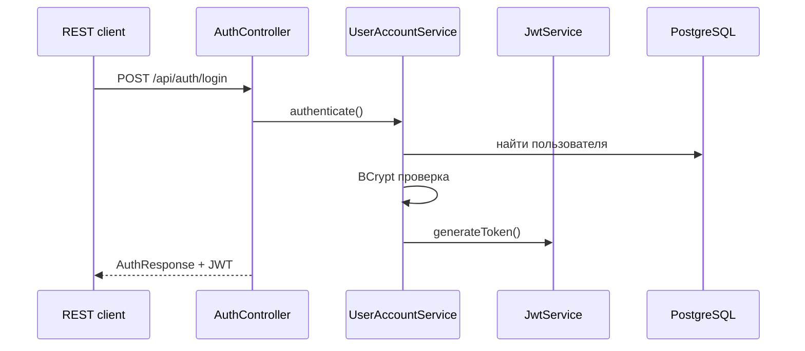
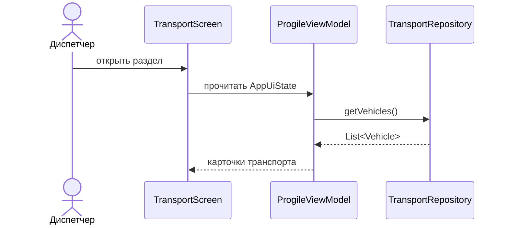
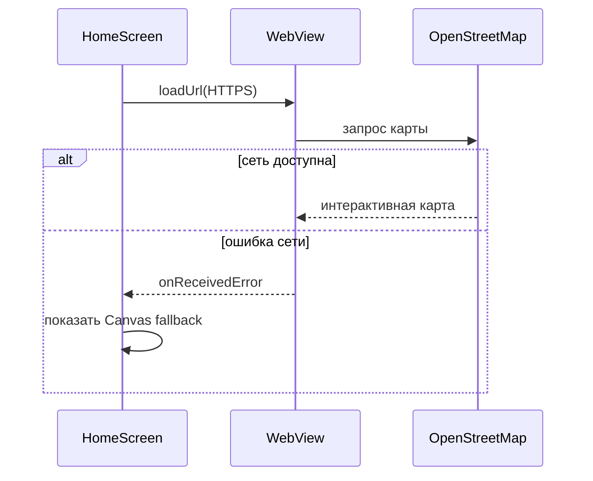

# Диаграммы последовательности

## Вход в Android-прототип

```mermaid
sequenceDiagram
    actor U as Пользователь
    participant UI as AuthScreen
    participant VM as ProgileViewModel
    participant AR as LocalAuthRepository
    participant SP as SharedPreferences
    U->>UI: email и пароль
    UI->>VM: login(email, password)
    VM->>AR: login()
    AR->>AR: проверка email и хеша
    AR->>SP: сохранить сессию
    AR-->>VM: AuthUser
    VM-->>UI: AppUiState(isAuthenticated=true)
```

## Серверный JWT-вход

```mermaid
sequenceDiagram
    participant Client as REST client
    participant A as AuthController
    participant S as UserAccountService
    participant J as JwtService
    participant DB as PostgreSQL
    Client->>A: POST /api/auth/login
    A->>S: authenticate()
    S->>DB: найти пользователя
    S->>S: BCrypt проверка
    S->>J: generateToken()
    A-->>Client: AuthResponse + JWT
```

## Открытие транспорта

```mermaid
sequenceDiagram
    actor D as Диспетчер
    participant UI as TransportScreen
    participant VM as ProgileViewModel
    participant R as TransportRepository
    D->>UI: открыть раздел
    UI->>VM: прочитать AppUiState
    VM->>R: getVehicles()
    R-->>VM: List<Vehicle>
    VM-->>UI: карточки транспорта
```

## Загрузка карты

```mermaid
sequenceDiagram
    participant UI as HomeScreen
    participant W as WebView
    participant OSM as OpenStreetMap
    UI->>W: loadUrl(HTTPS)
    W->>OSM: запрос карты
    alt сеть доступна
      OSM-->>W: интерактивная карта
    else ошибка сети
      W-->>UI: onReceivedError
      UI->>UI: показать Canvas fallback
    end
```
