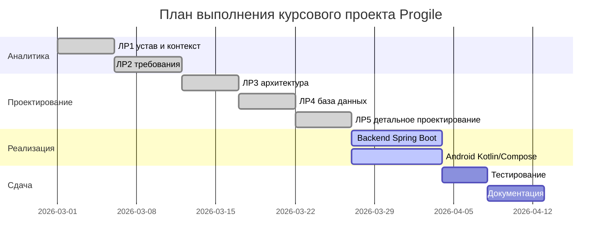

# Gantt

```mermaid
gantt
    title План выполнения курсового проекта Progile
    dateFormat  YYYY-MM-DD
    section Аналитика
    ЛР1 устав и контекст           :done, a1, 2026-03-01, 5d
    ЛР2 требования                 :done, a2, after a1, 6d
    section Проектирование
    ЛР3 архитектура                :done, b1, after a2, 5d
    ЛР4 база данных                :done, b2, after b1, 5d
    ЛР5 детальное проектирование   :done, b3, after b2, 5d
    section Реализация
    Backend Spring Boot            :active, c1, after b3, 8d
    Android Kotlin/Compose            :active, c2, after b3, 8d
    section Сдача
    Тестирование                   :d1, after c1, 4d
    Документация                   :d2, after d1, 5d
```
